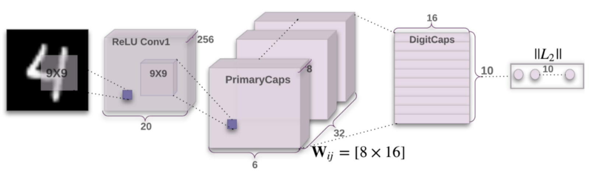
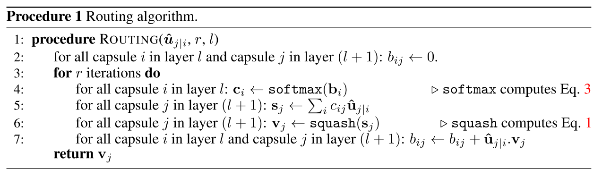
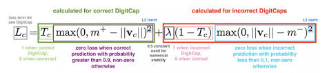

# Capsule Network: Dynamic Routing between Capsules

paper link: [paper](https://arxiv.org/pdf/1710.09829.pdf)

code link: [code](https://github.com/gram-ai/capsule-networks)

## Introduction

Even though Convolutional Neural Network or CNN has been the winner in Deep Learning Methods for Image Domain, they often fails in several cases. A biggest hole in CNN mechanism is that CNN cannot adapt to variant in scale or rotation (even though they are partly invariant regarding to translation). The second thing is that CNN does not reflect the way human brain processes image: we do that by making a parse tree! Therefore, CapsNet is an attempt to solve these two problems of CNN, providing a more robust deep learning algorithm for image processing.

****
## Capsule Network

**1. Capsule**
   
A capsule is a group of neurons. Its output, instead of being a single scalar like a neuron, is a vector called "*activation vector*". This activation vector serves 2 roles:
- whether the object entity (object or object's part) is in the image
- what kind of properties does the object entity has

The presence of object entity is represented by the activation vector's length (being normalized so that we can have a probability), while the properties are represented by activation vector's orientation.

*The image above describe CapsNet architecture: it consists of a Conv2d followed by 2 capsule layers 
named Primary Caps and Digit Caps.*

**2. Capsule network**

A capsule network has the structure of a tree, where each branch connection are dynamically determined based on their "agreement". Each node in the tree is a capsule, which is responsible for a trait/object part of the whole picture. The connection of capsules between layers in the tree (or *tree branch*) is determined by the agreement between the trait that each capsule contains. 

Take an example of a cat image: we know the image is a cat image since it has an object, which possesses 2 cat ears, two cat eyes, four cat legs, etc. When we pass the image to the first layer of the capsule network, we would like each capsule be responsible to identify those body part, and then, at the next layer of the capsule network, we will synthesize those information (e.g.: 4 legs, 2 triangular ears, etc.) and make a pass to capsule that was responsible to output a cat vector. So this capsule (the one responsible for a cat vector), should have a high agreement with all capsule nodes in previous layer that highlight cat body part (like those 6 capsules mention above), and dis-regards those capsule that are not so relevant (for example, we have capsule in first layer responsible for human eyebrows which is not really relevant to cat image). 

Therefore, the only question left is how should the "*agreement*" be calculated between layer, and the paper: "Dynamically routing between Capsules" does exactly that.

****
**3. Dynamically Routing between capsule**

3.1 Affine Transform

Let **** the input from lower capsule (which is a vector), we apply a vector multiplication to it in order to get affine transformation robustness, so the new input to the next layer's capsule j is:

3.2. Weighted Average

We find a set of scalar  such that they some to 1 and contain some information about the mutual relationship between capsule i and capsule j. If we have such set of scalar, then we can calculate the output at capsule j as:

3.3. Activation function

Let  be final vector output of capsule j,  be the output of capsule before going through activation. Activation function of the capsule will make length of $s_j$ close to 1 if its length is big, and close to 0 if the length is small, hence, we have the *squashing* activation function:

3.4. Calculation of 

So all left is just how can we come up with the set of routing parameters .

It is easy to see that what  does actually is similar to the "*agreement*" factor between 2 capsules that was discussed previously. One easy way to do it is that we can calculate the dot product between output vector of capsule j () and the converted output vector of capsule i in previous layer (which is ). Hence, the author comes up with idea of dynamic routing algorithm, which does exactly what describe above:

****
### Loss function and Task to learn

The CapsNet described in the paper was used for image classification task (on MNIST). As final output are vectors, whose length indicates the probability of object presence, we have to use a different loss function than what we have used normally with ConvNet followed by Fully Connected layer (i.e. mse_loss, l1_loss, etc.)

Such loss is calculated as follow:

For each digit capsule k:

The explanation of each component in the loss is as the following image:

To make CapsNet more robust, the author trained it with a second task: to reconstruct the image from the activation vector only. The loss for this task is similar to an auto-encoder, which is a mse-loss or l1-loss between original image and reconstructed one.

