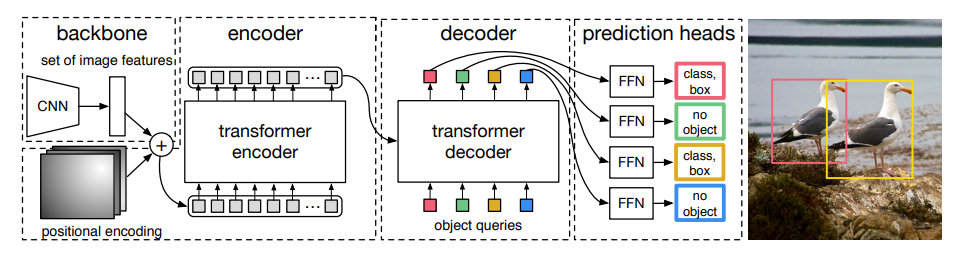
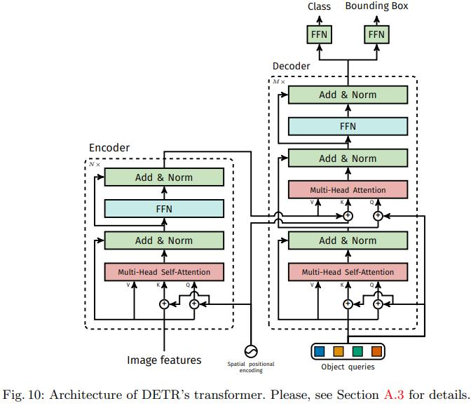

# Detection Transformer (DETR)

Paper Link: [link](https://arxiv.org/pdf/2005.12872.pdf)

Code Link: [code](https://github.com/facebookresearch/detr)

Interative Colab Notebook: [colab](https://colab.research.google.com/github/facebookresearch/detr/blob/colab/notebooks/detr_demo.ipynb)

Even though Transformer achieved a lot of success recent years in several NLP task, the application of it to Computer Vision is just to be focused. DETR developed by Facebook AI (FAIR) was the very **first** model that apply the Transformer model in Object Detection.

Previously, many (if not all) of object detection algorithms tries to reformulate the problem (to predict different label) or to add prior knowledge (like anchor) in order to solve the problem. 

The ultimate goal of DETR is:
- The first paper that successfully apply transformer in object detection.
- The first competitive end-to-end model that directly output the prediction set without any additional knowledge. 
****
## Problem Formulation

Given an image **I**, the goal is to find a set **S** of bounding boxes and their according labels . 

****
## Proposed Solution

DETR outputs a set of bounding boxes by treating the set as the output of Transformer Decoder. Since the output is a set, we need a loss that is same to all permutation of the output and labels. Also, since output set is not a sequence and all prediction are not time-wise dependence, DETR would output all boxes at once. They achieve these two by 2 methods: Bi-partite Matching Loss for Set Matching and Non-autoregressive Transformer for one-time boxes outputing.

**1. Bi-partite Matching Loss**

Given a set of k ground truth results {yi} and a set of N prediction results {}. Suppose that we have N > k (we can choose N big enough for all images). We will find the optimal set order of predicted results by the following formula:

where L denotes the matching cost between 2 particular instance, and sigmas denote the permutations. The argmin was computed by using Hungarian algorithm.

Then the Bi-partite matching loss is defined as:

This bi-partite loss helps optimize the set predictions since it can account for the invariant with respect to the set order.

**2. Non-autoregressive Transformer**

Due to the fact that the predicted set has no temporal dependency, it would be nice if Transformer Decoder can output all of the result at once. And this model does exactly that.

**3. DETR Model**

1. Backbone
   
   It can be any CNN backbone (VGG, Resnet, etc.) in order to sample the image. In the paper, they mainly use Resnet50 for backbone network. Typically, the output of the network are Cx[H/s]x[W/s] with C = 1024 and s = 32

2. Encoder
   
   After the image I (size HxW) was passed to the backbone, we will get a set of features. However, to reduce the complexity of computation, the features was then passed to a 1x1 convolutional layer to reduce the depth from C to d. The feature map of shape dxHxW was then reshape into HW feature vectors of dimension d, which were then being positionally encoded like any other Transformer input. 

3. Decoder
   
   Since we want to decode all at once, the positional embedding of the input in Decoder Stage would be different from normal Transformer. DETR uses a special position embeddings that can reflect invariant in permutation. These N special vectors are called *"object queries"* and was also passed to Transformer Decoder and a final Feed Forward Layer to get N final predictions of the bounding box and classification score.

    

    

