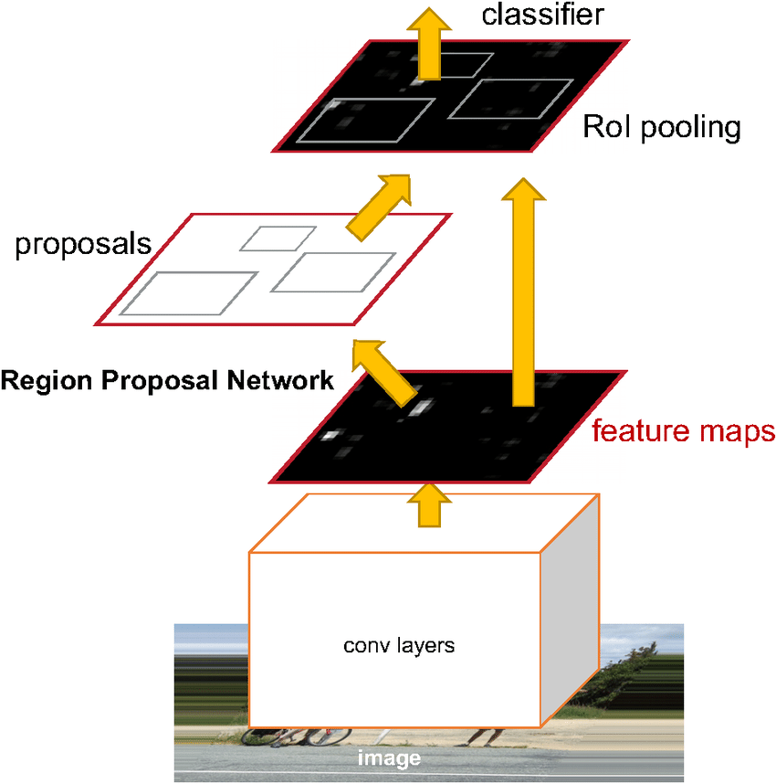

# Faster RCNN

Paper link: [link](https://arxiv.org/abs/1506.01497)

Faster RCNN is a relatively old but gold model in object detection. Even though it has been there for a while, the model has been modified a lot from the original paper. In this page I will review the core concept of Faster RCNN.

In general, Faster RCNN consists of two stages: Region Proposal Network (RPN) and Fast RCNN. 
- The first stage, RPN, is responsible for picking the so-call regions of interest in the image, or locations where the object are possibly in. 
- The second stage, Fast RCNN takes all of the regions from RPN and tries to classify the class of such regions.

****
## Problem Formulation

As we divide the model into 2 stages, we will have two sub-problem for each stage as follow:

**RPN**

Given an input feature map U (the one after passing the image through a backbone FCN), and a set of anchors and their labels S = {ai, ci},where:
-  containing information about coordinate of the anchor's center, and the anchor's width and height.
-  is the objectness score of the anchor, whether they are ambiguous (can be a bounding box or background), background, or containing object. 
  
- The score c is obtained by mapping the anchor to the original image, and calculate the maximal IoU (intersection over union) with all bounding boxes. 
  - If the max IoU is greater than a high threshold, c=1 (foreground anchor)
  - If the max IoU is less than a small threshold, c=0 (background anchor)
  - If the max IoU falls between low and high, c=-1 (ambiguous anchor)

The goal of RPN is then to minimized a combined loss function of classification score of anchors and regression score of predicting the anchors. Therefore, when RPN converge, its output would contain useful information of the possibly object containing boxes.

**Fast RCNN**

Given the set of foreground regions  predicted from RPN and the image feature U from backbone network, the goal of RPN is to do 2 things:

- To regress the bounding box coordinates x,y,w,h of the foreground regions. 
- To classify the bounding box: whether they truly contain an object, and which object is it.

Therefore, Fast RCNN consist of 2 branches: Regression branch and Classification branch.

****
## Proposed Solution

**Anchor Generation**

**ROI Pooling Layer**