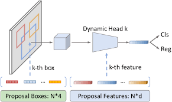
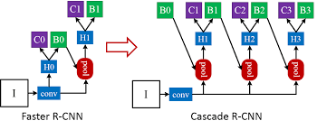
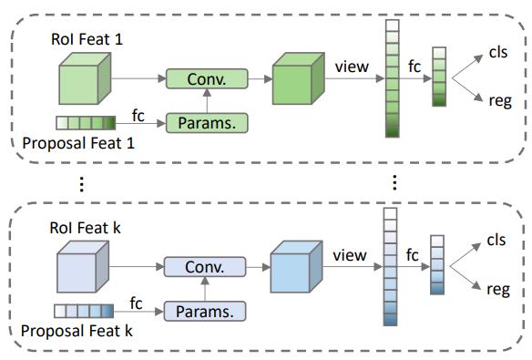

# Sparse RCNN

paper link: [paper](https://arxiv.org/abs/2011.12450)

code link: [code](https://github.com/PeizeSun/SparseR-CNN)

## Introduction
Object Detection algorithm up to DETR uses density estimation method to output a set of bounding boxes. However, DETR has problem with their slow convergence rate and their inability to work with FPN. This paper use the self attention mechanism along with some modification of the so-call proposal feature and proposal bounding boxes takes advantages of both Faster-RCNN mechanism and DETR. The novel approach makes Sparse-RCNN the first algorithm that approach the problem in two-stage with sparse set of result coming from the image.  
****
## Problem Formation
Given an image I, the goal of Sparse RCNN is to guess a sparse set of region proposal and fine-tune the sparse set of proposed regions to get the final class and boudning boxes result.
****
## Proposed Solution

**1. Iterative Box Refinement**

Borrowing the idea of Cascade RCNN, the model use iterative box refinement process to guess final set of bounding boxes. That is: instead of directly output boxes and class after the second stage, the predicted boxes will be passed as a proposal region again to the next step of yet another RCNN head. 

**2. Learned proposed regions without anchor**

Normally in Faster-RCNN, we use a pre-defined set of anchors on each pixel of the map. This set of anchor represents density estimation since all the pixels of feature map have anchors. The task of RPN in first stage is to classify and regress each of the anchor and feed them into the next stage.
  
However, in Sparse RCNN, the network at initial will output a set of completely random set of regions in the image to feed into RCNN head, and regress the set gradually to get the final result of this proposed regions without any anchor. This make object detection so much more convinent and natural since we do not need any pre-defined knowledge like what we have to do with anchors.
  
**3. Dynamic Convolution**   

The biggest contribution of Sparse R-CNN is the Dynamic Convolution. After we get the set of proposed bounding boxes, they will be passed to ROI Pooling like normal RCNN, then interact with a "proposed features" vector through *Dynamic Convolution*. 

 
The proposed feature is just set of vectors (number of vectors = number of proposed boxes). Each of the vector will interact with pooled boxes in a manner of a matrix multiplication. The proposed feature vectors are also passed to a self-attention head. (I guess the effect of this is to suppress the regions that are likely to be from similar bounding boxes, but I am not quite sure).
   
The output of Dynamic Convolution layer is a set of 1-d features which are then passed to fully-connected layers to get class prediction and bounding boxes prediction like normal RCNN.
